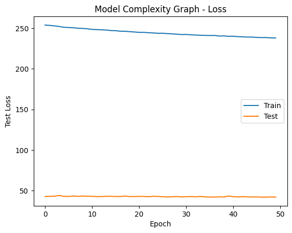
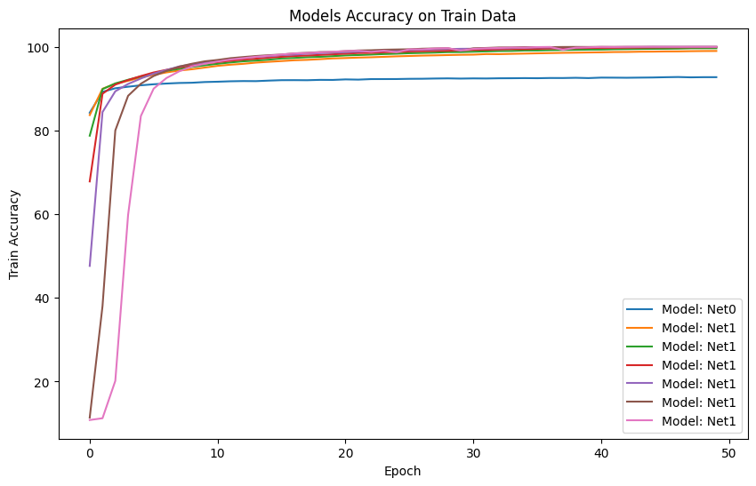

# Handwritten-Digit-Recognition
Handwritten Digit Recognition is a Deep Learning Project within the Deep Learning Course led by Dr. Hadjer Benmeziane in Limitless Learning institute

Thoughout this notebook, we will work to optimize a Pytorch model to recognize handwritten digits from the MNIST dataset.

# What I learned from this project
* Delved into PyTorch 👨‍💻 and mastered its basic operations to build powerful models.

* Explored a variety of training optimization techniques 🕵️‍♂️ such as adding dropout layers, implementing regulizers and utilizing early stopping to enhance model performance. 

* Conducted experiments with different hyperparameters 🔬, observing how they impacted my model's learning process and accuracy.

# Some Interesting Conclutions from the Project:
* Simple neural networks tend to learn at a slower pace compared to more complex ones.
  
  

* As the complexity of the model increases, its accuracy also tends to increase, and it converges at a faster rate.

 
 
This is evident from the graph, which shows that all complex models (Net1 ~ Net6) achieved 99% accuracy, while Net0 with no hidden layers could only reach 92% on both train and test data after 50 epochs.

* Early stopping is a useful technique to halt the training poccess when the model is no loger improving at an significant rate.

 This can help prevent overfitting and improve the overall performance of the model.
